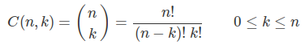
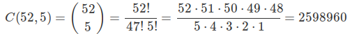
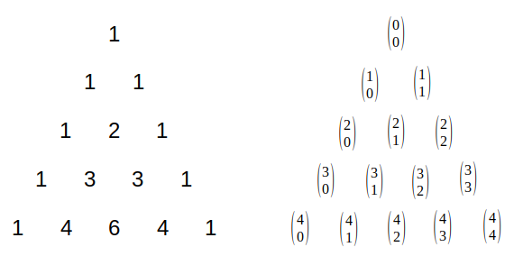

### The problem

If you have **n** unique items and choose **k** of them without replacement, and you *don't care about the order* in which they were selected (e.g. jackpot lottery numbers), then the number of ways to form such **combinations** is


These values are also known as **binomial coefficients**.

For example, the number of 5-card hands you can draw from a 52-card deck is



If your application requires many values for *C(n,k)*, then efficiency is a serious concern.  If we calculate the value of *C(n,k)* every time we needed it, we encounter a number of potential inefficiencies:

 - Calling a function to compute a factorial directly is inefficient
 - Representing large integers in memory can be challenging
 - Even though *C(n,k)* is guaranteed to produce an integer, computing it using floating point math may introduce problems.
 
---

### An efficient solution

There is an extremely fast and efficient way to pre-compute a lookup table for the values of *C(n,k)*.  It doesn't require any factorials, and it doesn't require any multiplications or division.  However, it *does* require that we compute **all** of the values of *C(n,k)* up to some maximum *n* value we may need.

What is this computational magic?

**Pascal's triangle**.   Pascal's triangle contains every one of the values of *C(n,k)*, and each row can be computed from the previous row using only sums.



etc....

---

The Python code presented here in module "combination_table.py" provides a class to implement this lookup table for *C(n,k)*.

In general, you import the python module "combination_table", and then create an instance of the **CombinationTable** object, specifying the largest value of n you will need:

```python
>>> from combination_table import CombinationTable
>>> from time import time
>>> start = time() ; cnk = CombinationTable(1000); print(time() - start)
0.04801654815673828
>>> # WOW, that was fast!!!
>>> print(cnk.combination(1000, 500))
270288240945436569515614693625975275496152008446548287007392875106625428705522193898612483924502370165362606085021546104802209750050679917549894219699518475423665484263751733356162464079737887344364574161119497604571044985756287880514600994219426752366915856603136862602484428109296905863799821216320
>>> print(cnk.combination(52, 5))
2598960
>>> print(cnk.combination(20, 5))
15504
>>> print(cnk.combination(12, 4))
495
>>> print(cnk.combination(0, 0))
1
>>> print(cnk.combination(1001, 1)
Traceback (most recent call last):
  File "<stdin>", line 1, in <module>
  File "<redacted>/combination_table.py", line 34, in combination
    f"n must be between 0 and {self._max_size}")
Exception: Error in combination(n,k) : n must be between 0 and 1000
```
Notice that the time taken to create and populate a very large lookup table is *extremely short* compared to the time required if factorials, multiplication, or division were used.  If you can afford the memory space, then it becomes amazingly efficient -- in Python -- to pre-compute **all** of the *C(n,k)* values you might need and save them in a lookup table rather than computing individual ones as they are needed.

Included in this repository is a Python file "test_combination_table.py" to output all of the values of *C(n,k)* up to some MAX_N value set in the file.

